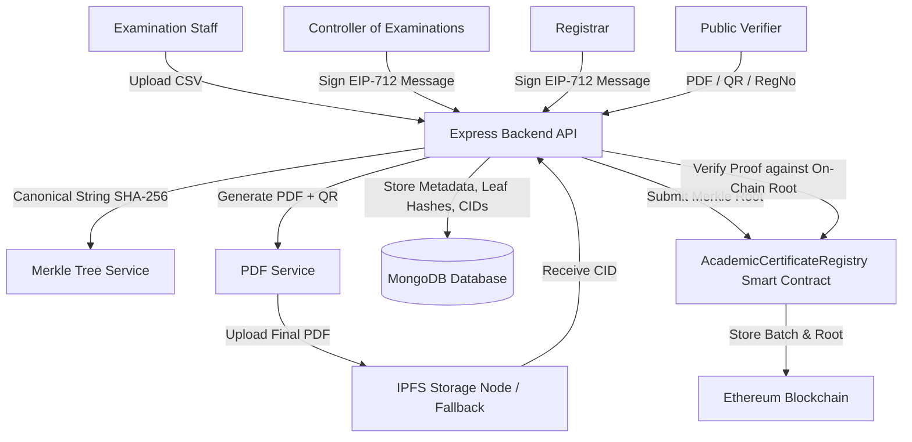

# Core System Architecture

The **Decentralized Academic Certificate Verification System** implements a hybrid architecture separating off-chain high-capacity data storage from on-chain immutable trust anchors.

## Hybrid Data Responsibilities

1. **MongoDB**:
   - User credentials & RBAC roles
   - Institution onboarding records
   - Certificate metadata, registration numbers, canonical strings
   - Certificate SHA-256 leaf hashes & Merkle proof arrays
   - IPFS CIDs & local PDF paths
   - EIP-712 approval signatures
   - Immutable audit logs & public verification logs

2. **IPFS**:
   - Stores ONLY final generated certificate PDF documents (CID referenced in MongoDB).

3. **Ethereum Blockchain (Hardhat)**:
   - Stores ONLY immutable batch records (`merkleRoot`, `batchId`, `institutionId`, `timestamp`, `exists`, `revoked`).
